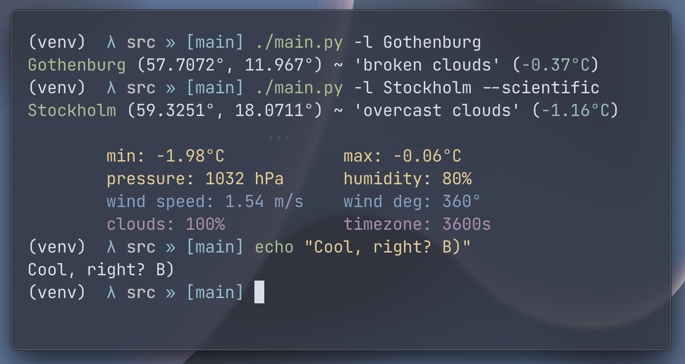
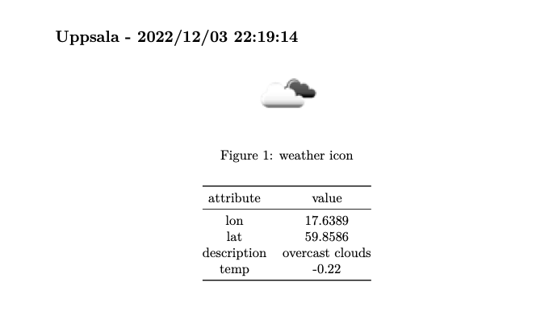

## Chalmers Teknologkonsulter - OpenWeatherMap `API` task case

`OpenWeatherAPI CLI` is a simple `CLI` application written in `Python3` that uses the [__OpenWeatherMap__](https://openweathermap.org/) `API` to _fetch_ __weather data__ for a given location. Moreover, it can create a [`Markdown`](https://www.markdownguide.org/) file with a table containing the weather data for a given location. Lastly, it can generate a `PDF` file from the `Markdown` file, using the `Pandoc` library.

### Installation

Indeed, [`Python3`](https://www.python.org/downloads/) is required a __requirement__ for this application. Moreover, the `Pandoc` library is required for the `PDF` generation (this is optional). The `Pandoc` installation instructions can be found [here](https://github.com/jgm/pandoc/blob/master/INSTALL.md).

Moreover, to use the `API` __service__, one must have an account and an `API` key. The `API` key can be obtained [here](https://home.openweathermap.org/api_keys).

Then, inside the __root__ of the project, create a file `.env` with the following content:

```text
API_KEY=<your_api_key>
```

\*Where `<your_api_key>` is your `API` key obtained from the `OpenWeatherMap` __website__.

Inevitable, the `.env` file is not under version control, so it is safe to store your `API` key - the __key__ is only visible in the __local__ environment.

1. Clone the repository (via [`git`](https://git-scm.com/downloads))

```sh
$ git clone https://github.com/michalspano/OpenWeatherMaps.git && cd OpenWeatherMaps
```

2. Create a `Python` __virtual environment__ in the project directory

```sh
$ python3 -m venv venv
```

3. Activate the virtual environment

The virtual environment can be activated by running the __following command__ (on a `Unix` system):

```sh
$ source venv/bin/activate
```

For `Windows` systems, the command is:

```sh
$ .\venv\Scripts\activate
```

4. Install the dependencies from the `requirements.txt` file

```sh
$ pip3 install -r requirements.txt
```

5. Run the application

```sh
$ python3 main.py [options]
```

Using the defined __shebang__ in the `main.py` file, the application can be run directly by executing the following command:

```sh
$ ./main.py [options]
```

_Voilà!_ The application is now ready to be used.

### Usage

```text
$ python3 src/main.py -h

usage: main.py [-h] -l  [-s | -sc] [-o]

OpenWeatherAPI CLI

options:
  -h, --help         show this help message and exit
  -l , --location    the location to get the weather data for
  -s, --simple       display the data in a simple way (default)
  -sc, --scientific  display the data in a scientific way
  -o , --output      write to a markdown file
```

__Note__: As of now, the application only supports the `metric` system of units. This means that the temperature is displayed in `Celsius` and the wind speed in `m/s`. The `API` supports the `imperial`, `standard` and `metric` systems of units. For future development, the application can be extended to support the other systems of units.

### Examples

```text
$ ./main.py -l Gothenburg 

Gothenburg (57.7072°, 11.967°) ~ 'broken clouds' (-0.37°C)
```

```text
$ ./main.py -l Stockholm --scientific

Stockholm (59.3293°, 18.0686°) ~ 'overcast clouds' (-1.13°C)
                        ...
        min: -1.95°C            max: -0.03°C
        pressure: 1032 hPa      humidity: 80%
        wind speed: 1.54 m/s    wind deg: 360°
        clouds: 100%            timezone: 3600s
```

#### Inside a terminal emulator




### More examples

```sh
$ ./main.py -l Uppsala -o uppsala.md
```

#### `Markdown` file content

```md
## Uppsala - 2022/12/03 22:56:43


| attribute | value |
| :---: | :---: |
| lat | 59.8586 |
| lon | 17.6387 |
| description | overcast clouds |
| temp | -0.22 |
```

#### Rendered `Markdown` file

---

## Uppsala - 2022/12/03 22:56:43


| attribute | value |
| :---: | :---: |
| lat | 59.8586 |
| lon | 17.6387 |
| description | overcast clouds |
| temp | -0.22 |

---

### Rendered `PDF` file 

Using the `Pandoc` library:

```sh
$ ./scripts/export.sh uppsala.md uppsala.pdf
```

__Note__: The `export.sh` script can automatically detect whether the `Pandoc` library is installed or not. If it is not installed, the script will not run and the user will be _notified_.



### License

This project is licensed under the __MIT License__ - see the [LICENSE](https://github.com/michalspano/OpenWeatherMaps/blob/main/LICENSE) file for details.
